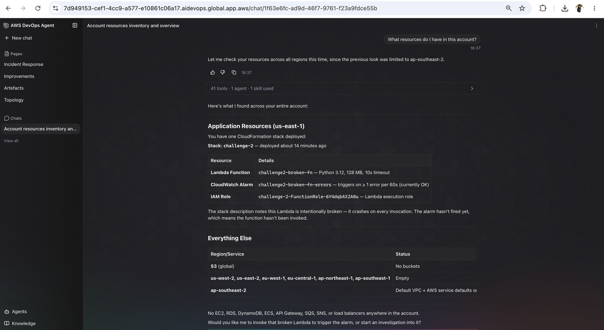
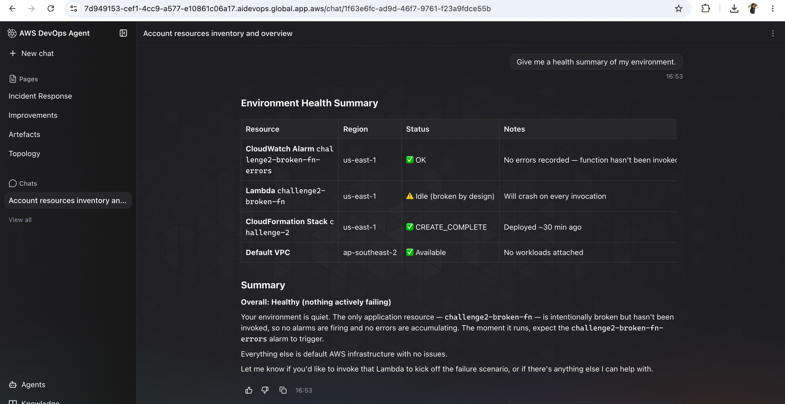
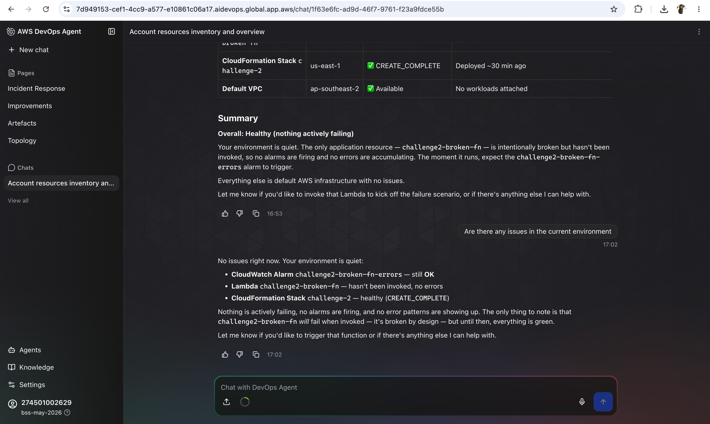

# Challenge 1 — Findings

## What I asked the agent

* What resources do I have in this account?
* Is anything unhealthy right now?
* Give me a health summary of my environment.
* Are there any issues in the current environment?

## What the agent told me

The agent found that my AWS account contains a single CloudFormation stack named challenge-2 in the us-east-1 region. The stack includes a Lambda function called challenge2-broken-fn, a CloudWatch alarm named challenge2-broken-fn-errors, and an IAM execution role.

The agent also reported that there are no other application resources in the account, such as EC2 instances, RDS databases, S3 buckets, DynamoDB tables, ECS clusters, or load balancers.

From a health perspective, the environment is currently healthy because the Lambda function has not been invoked yet. The CloudWatch alarm remains in the OK state, and no errors have been recorded. The agent noted that the Lambda function is intentionally broken and will fail once it is executed.

## Evidence
- [ ] Screenshot: the agent's reply

