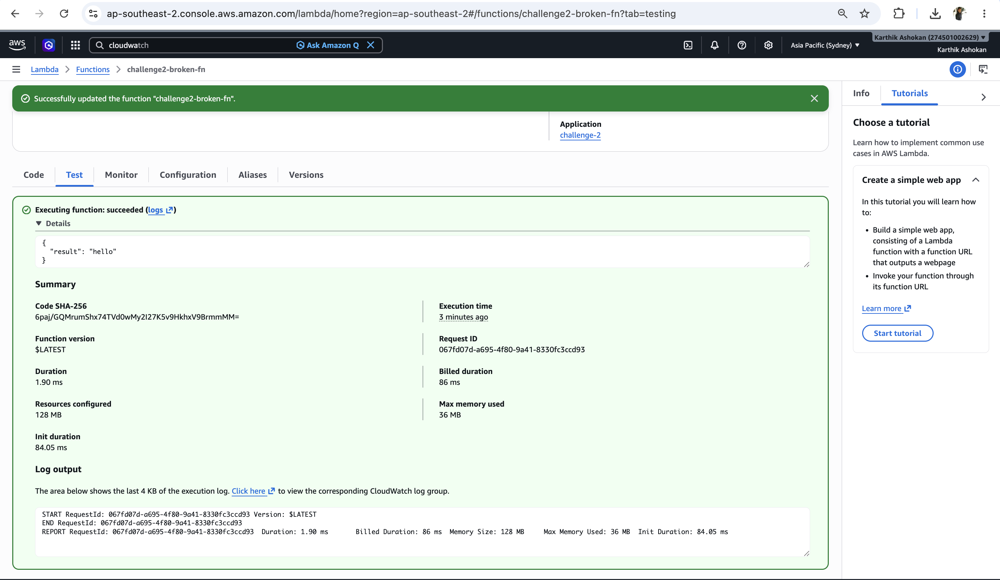
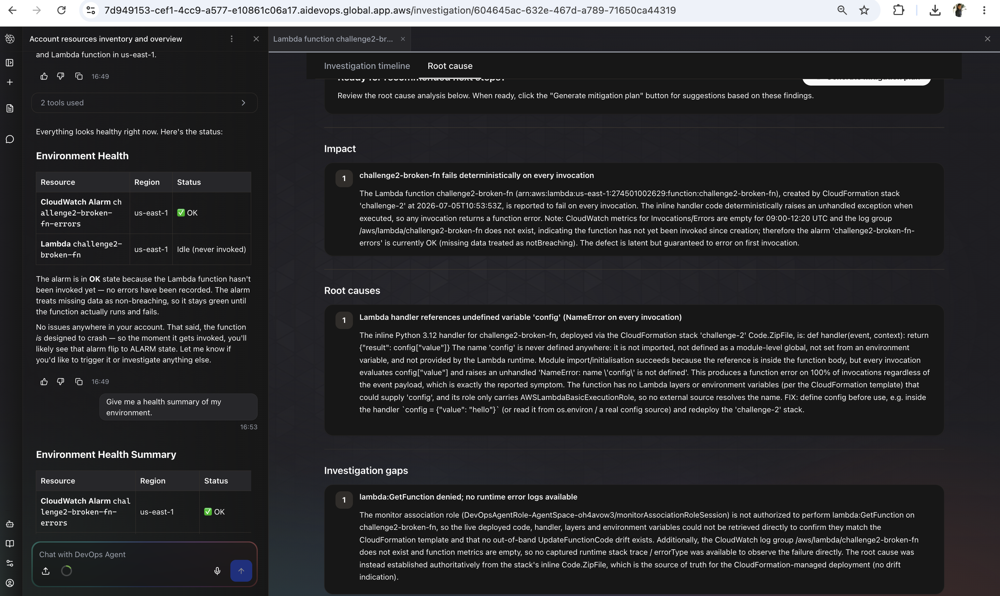
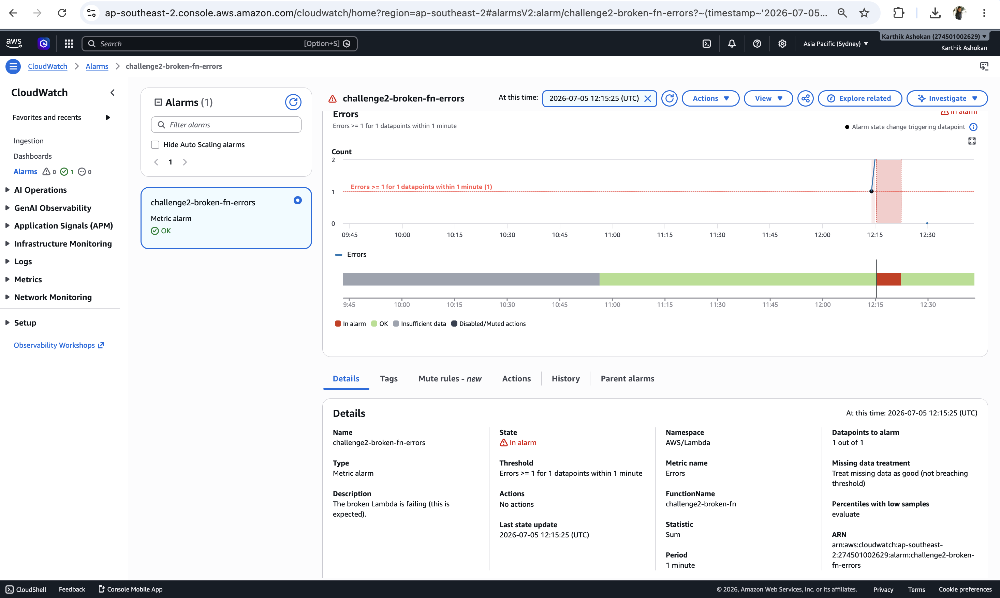
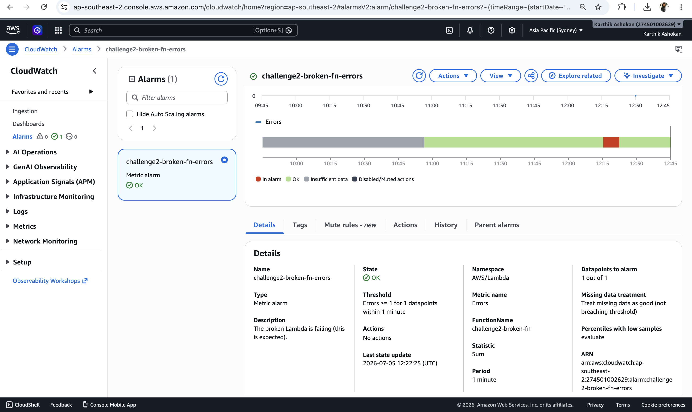

# Challenge 2 — Findings

## Root cause
The Lambda function challenge2-broken-fn failed on every invocation because the handler was trying to access config["value"], but the config variable was never defined. This caused a NameError exception every time the function executed, resulting in a 100% failure rate.

## Fix applied
I defined the config variable before using it in the handler.

```config = {"value": "hello"}
def handler(event, context):
    # This function is broken on purpose. Use the DevOps Agent to
    # find out why every invocation fails.
    return {"result": config["value"]}```

After deploying the change and testing the function again, the Lambda executed successfully and the challenge2-broken-fn-errors CloudWatch alarm returned to the OK state.



## Evidence
- [ ] Screenshot 1: the agent's root-cause finding

- [ ] Screenshot 2: recovery — the `challenge2-broken-fn-errors` alarm green and a successful Test




