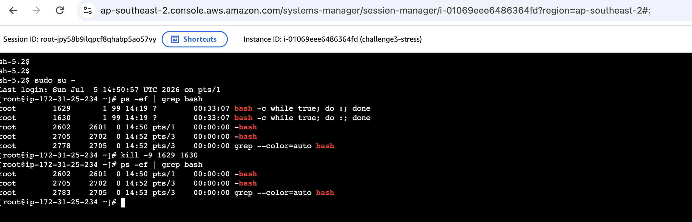
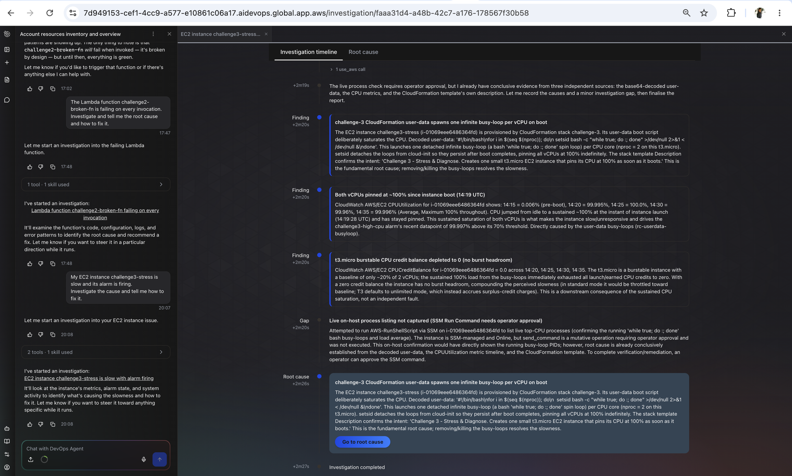
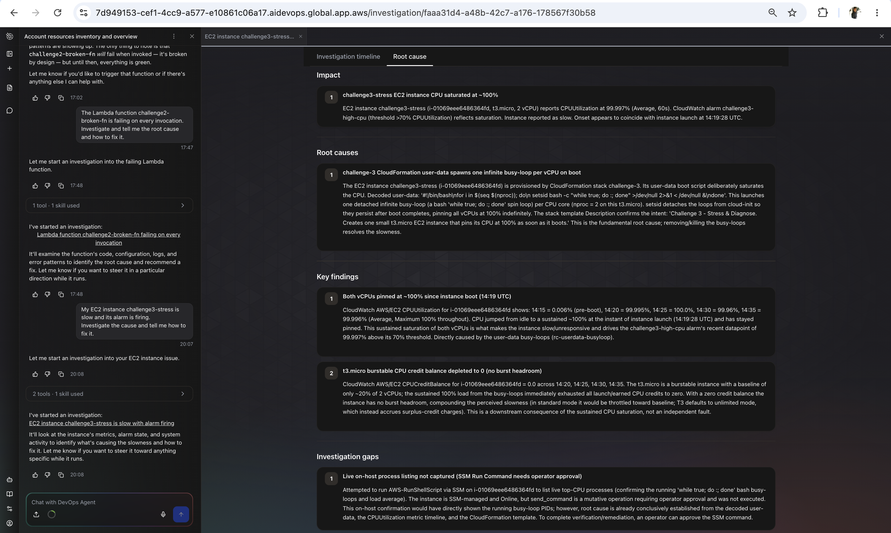
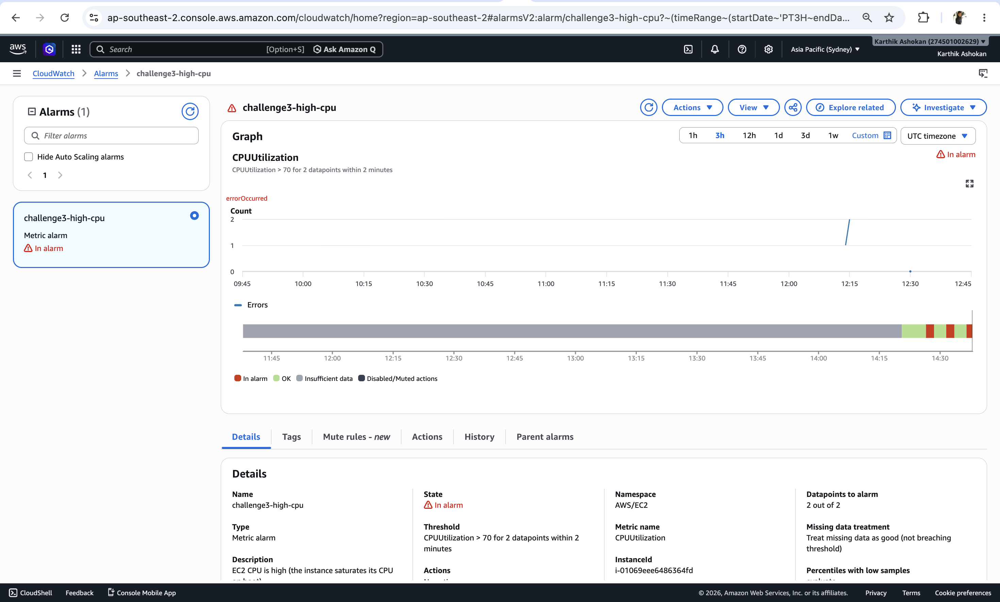
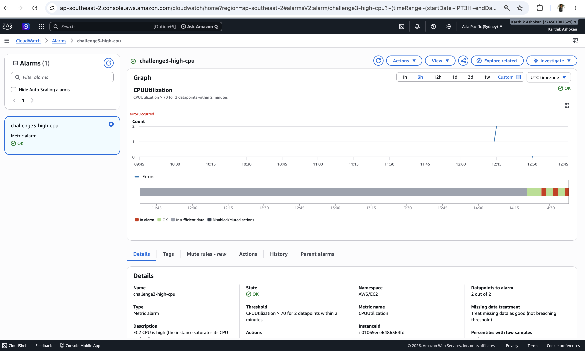
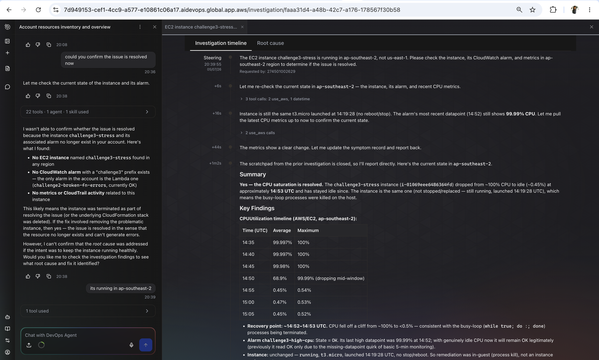
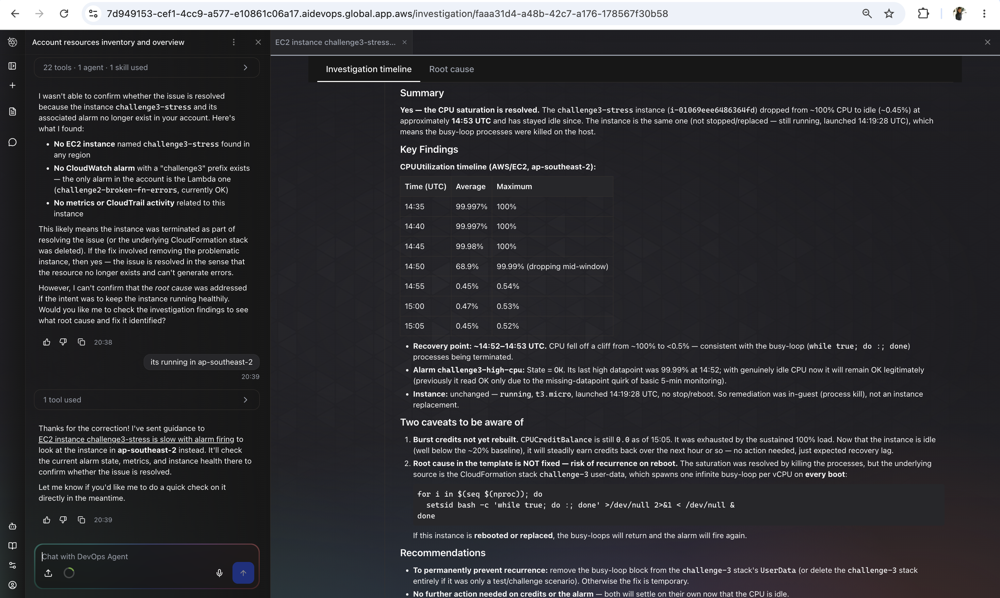
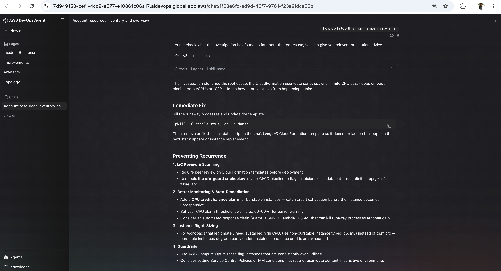

# Challenge 3 — Findings

## Root cause
The EC2 instance challenge3-stress (i-01069eee6486364fd) is intentionally configured to consume 100% CPU immediately after boot.
The CloudFormation stack challenge-3 injects the following user-data script:
#!/bin/bash
for i in $(seq $(nproc)); do
  setsid bash -c "while true; do :; done" >/dev/null 2>&1 < /dev/null &
done

Since the instance is a t3.micro with 2 vCPUs, two infinite spin loops are created, causing both CPUs to remain at nearly 100% utilization indefinitely.

## Fix applied
Logged onto the EC2 server thru SSM Manager and killed the bash process to recover.

## Evidence
- [ ] Screenshot 1: the agent's diagnosis

- [ ] Screenshot 2: recovery — the `challenge3-high-cpu` alarm back to green

