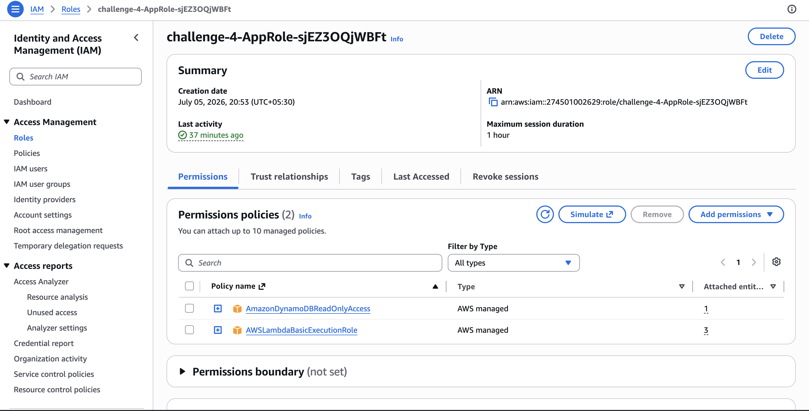
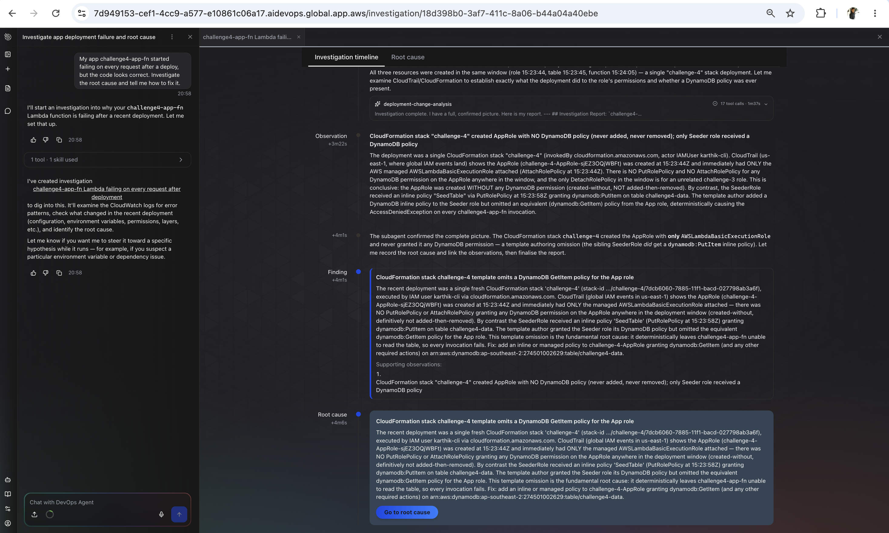
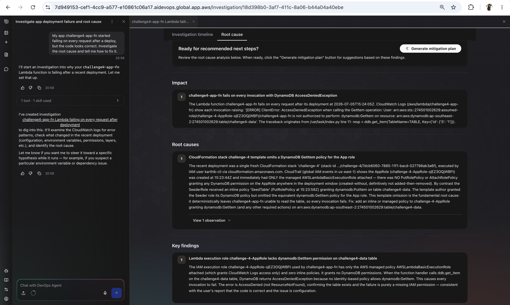
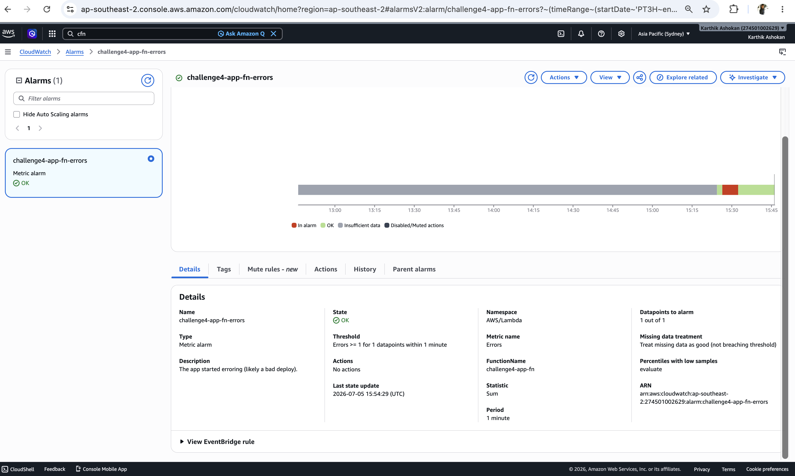
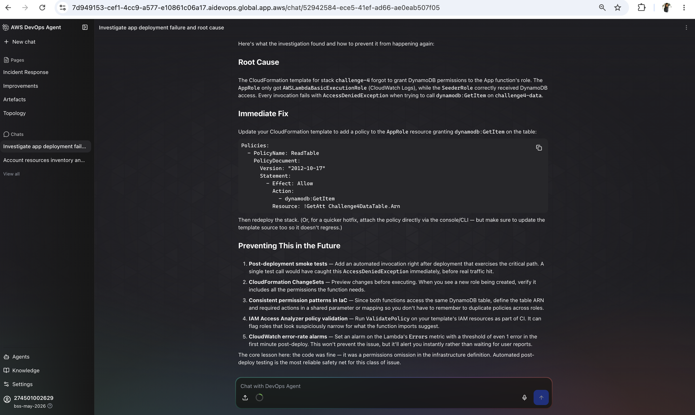

# Challenge 4 — Findings

## Root cause
The CloudFormation template created the Lambda execution role (challenge-4-AppRole) with only the AWSLambdaBasicExecutionRole managed policy and did not grant any DynamoDB permissions. As a result, challenge4-app-fn had no permission to perform dynamodb:GetItem on the challenge4-data table. Every invocation that attempted to read from DynamoDB failed with an AccessDeniedException. This was a configuration error in the IAM permissions defined by the CloudFormation stack, not an application code issue.

## Fix applied
Attached an IAM Policy "AmazonDynamoDBReadOnlyAccess" to this Role challenge-4-AppRole-sjEZ3OQjWBFt to fix the issue.
This policy AmazonDynamoDBReadOnlyAccess has ""dynamodb:GetItem" Permission as well so added this to fix the issue.

## Evidence
- [ ] Screenshot 1: the agent's root-cause finding

- [ ] Screenshot 2: recovery — the function returning the product and the `challenge4-app-fn-errors` alarm green

