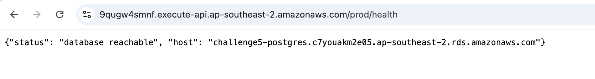
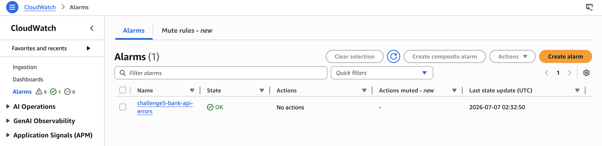
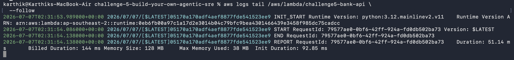
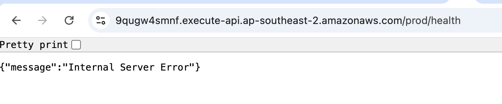
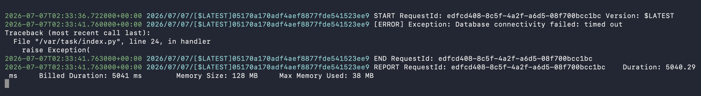
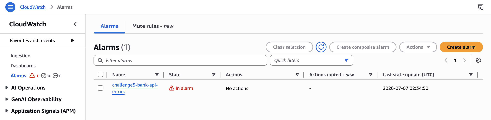
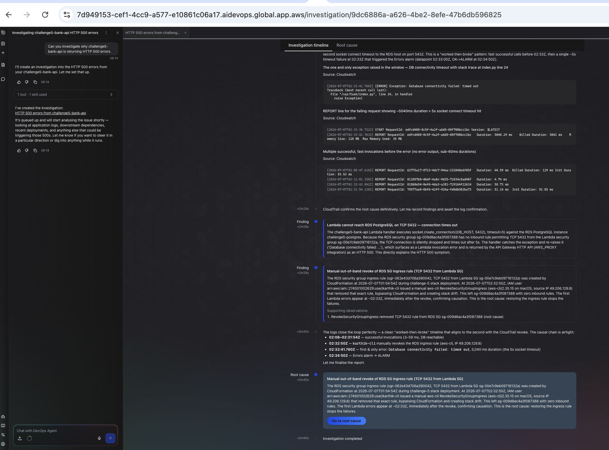
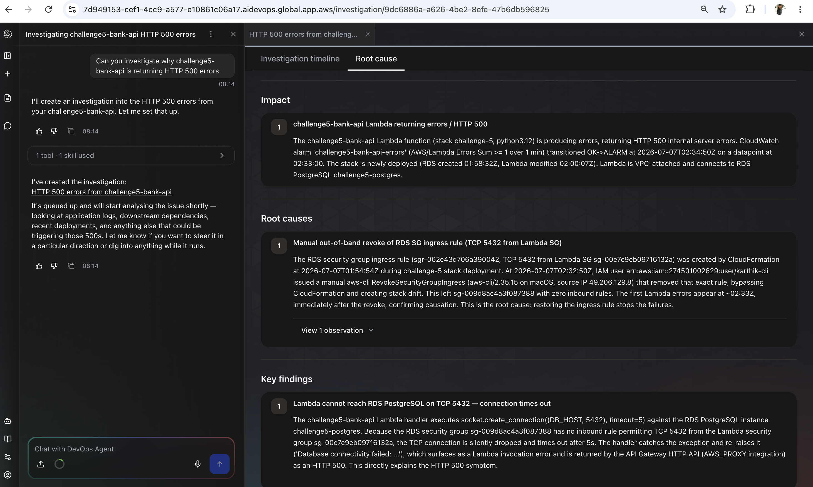
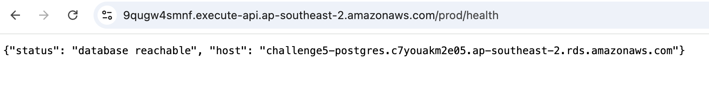
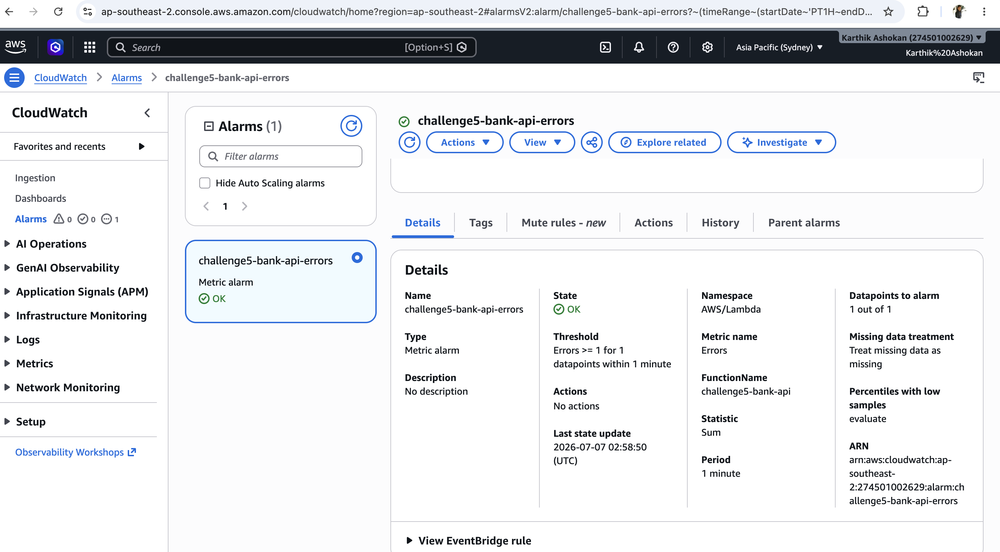

# Challenge 5 — Findings

# Banking API Database Connectivity Outage Simulation

## Overview

This challenge simulates a realistic production outage where a banking API loses connectivity to its PostgreSQL database because of an accidental Security Group change.

The objective was to demonstrate how AWS DevOps Agent can investigate an application failure, correlate metrics and logs, and identify the underlying infrastructure issue.

---

# Architecture

```text

Client

  ↓

API Gateway

  ↓

Lambda (challenge5-bank-api)

  ↓

Amazon RDS PostgreSQL (challenge5-postgres)

```

---

# Infrastructure as Code

The entire environment was provisioned using AWS CloudFormation.

Artifacts:

- `template.yml`

- `rds-connectivity-runbook.md`

The CloudFormation template deploys:

- API Gateway

- AWS Lambda

- Amazon RDS PostgreSQL

- Security Groups

- IAM Roles

- CloudWatch Alarm

The application exposes a health endpoint through API Gateway that verifies connectivity to the PostgreSQL database.

---

# Provisioning Commands

## Deploy the Environment

```bash

aws cloudformation deploy --template-file template.yml --stack-name challenge-5 --parameter-overrides DBPassword='Password123!' --capabilities CAPABILITY_NAMED_IAM --region ap-southeast-2

```

> **Note: Password123! is only a temporary password used for demonstration purposes.

---

## Verify Stack Status

```bash

aws cloudformation describe-stacks --stack-name challenge-5 --region ap-southeast-2 --query "Stacks[0].StackStatus"

```

Expected:

```text

CREATE_COMPLETE

```
---

## Retrieve the API Endpoint

```bash

aws cloudformation describe-stacks --stack-name challenge-5 --region ap-southeast-2 --query "Stacks[0].Outputs[?OutputKey=='ApiUrl'].OutputValue" --output text

```

---

## What I built and how I broke it
I built a simple banking API using API Gateway, AWS Lambda, and Amazon RDS PostgreSQL.

Flow -

Browser/Client → API Gateway → Lambda → PostgreSQL RDS




The Lambda function performs a database connectivity check by opening a TCP connection to the PostgreSQL endpoint on port 5432 and returns a success response when the database is reachable.



After verifying that the application was healthy and returning HTTP 200 responses, I intentionally simulated a production outage by removing the inbound security group rule on the RDS security group that allowed traffic from the Lambda security group to PostgreSQL (TCP port 5432).





This simulated a real-world production scenario where a security hardening change or infrastructure modification accidentally removes database connectivity.

# Simulate Production Outage

## Retrieve Security Group IDs

## Verify Stack Status

```bash

aws cloudformation describe-stacks --stack-name challenge-5 --region ap-southeast-2 --query "Stacks[0].StackStatus"

```
---

Expected:

```text

LambdaSecurityGroup : sg-00e7c9eb09716132a

RdsSecurityGroup    : sg-009d8ac4a3f087388

```

---

## Remove Database Connectivity

Remove the PostgreSQL Security Group rule:

```bash

aws ec2 revoke-security-group-ingress --group-id sg-009d8ac4a3f087388 --protocol tcp --port 5432 --source-group sg-00e7c9eb09716132a --region ap-southeast-2

```

---

---

## Generate Failures

```bash

URL=https://9qugw4smnf.execute-api.ap-southeast-2.amazonaws.com/prod/health

for i in {1..20}; do

  curl -s $URL

  echo

done

```

Expected:

```json

{"message":"Internal Server Error"}

```

---

## What the agent found
The AWS DevOps Agent investigated the CloudWatch alarm and identified that the Lambda function was failing due to database connection timeouts.

The RDS instance itself was healthy and available, but the Lambda function could no longer establish a network connection to the database because the PostgreSQL ingress rule had been removed from the RDS security group.
    
The root cause was a network configuration issue: a missing security group rule prevented the application from reaching its database dependency, resulting in HTTP 500 errors.

## Fix applied
I restored the inbound security group rule on the RDS security group to allow TCP port 5432 traffic from the Lambda security group.

After restoring the rule:

- Lambda successfully connected to the database again.
- The API resumed returning HTTP 200 responses.
- CloudWatch alarms returned to the OK state.
- The application fully recovered without any code changes.

I restored the inbound Security Group rule on the RDS Security Group to allow TCP port 5432 traffic from the Lambda Security Group.

No code changes were required.

---

## Restore Database Connectivity

Re-add the PostgreSQL Security Group rule:

```bash

aws ec2 authorize-security-group-ingress --group-id sg-009d8ac4a3f087388 --protocol tcp --port 5432 --source-group sg-00e7c9eb09716132a --region ap-southeast-2

```
---

# Verify Recovery

```bash

curl https://9qugw4smnf.execute-api.ap-southeast-2.amazonaws.com/prod/health

```

Expected:

```json

{

  "status": "database reachable",

  "host": "challenge5-postgres.c7youakm2e05.ap-southeast-2.rds.amazonaws.com"

}

```

The CloudWatch alarm returned to:

```text

OK

```

---

# Runbook

A detailed runbook was created:

```text

rds-connectivity-runbook.md

```

The runbook includes:

- Investigation steps

- Validation procedures

- Recovery steps

- Prevention recommendations

---

## Evidence
- [ ] Screenshot or short recording of the AWS DevOps Agent investigating the CloudWatch alarm and identifying the missing RDS security group rule.


- [ ] Screenshot showing the API returning `{"status":"database reachable"}` after restoring the security group rule and the alarm returning to OK.


- [ ] Bonus: Added a runbook documenting the investigation steps for database connectivity failures caused by security group misconfigurations.

---

## Cleanup

```bash
aws cloudformation delete-stack --stack-name challenge-5 --region ap-southeast-2

aws cloudformation wait stack-delete-complete --stack-name challenge-5 --region ap-southeast-2
```
---

